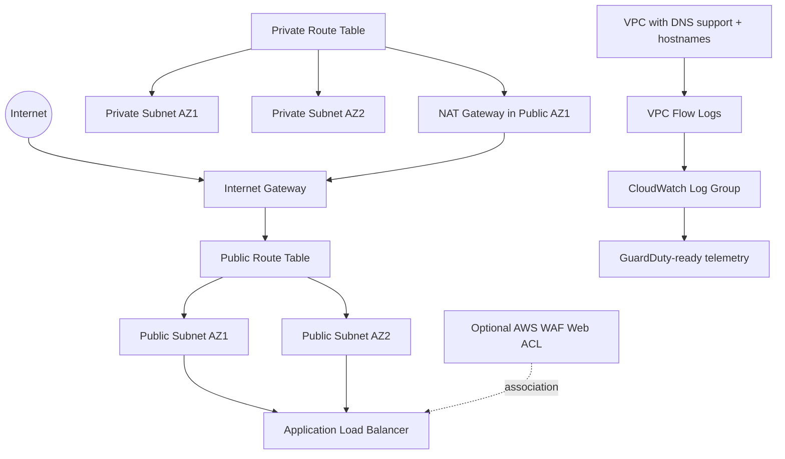

# terraform-aws-secure-vpc

A production-minded Terraform module for creating a secure AWS VPC foundation with two Availability Zones, private/public subnet tiers, VPC Flow Logs, and a WAF-ready Application Load Balancer.

GitHub account target: `giselleevita`

## Project Overview
This module provisions a reusable secure network baseline that is easy to audit and ready for downstream workloads. It is intentionally opinionated to reduce insecure defaults and help teams move faster with consistent guardrails.

## Why This Matters for Cloud Security
- Enforces network segmentation by separating public and private subnets.
- Enables VPC Flow Logs for visibility and threat investigation.
- Uses DNS support/hostnames and full traffic logging to support GuardDuty detections.
- Exposes internet traffic through an ALB that can be associated with AWS WAF.

## Architecture Summary
- One VPC with configurable CIDR.
- Two public subnets across two AZs for internet-facing components.
- Two private subnets across two AZs for internal workloads.
- Internet Gateway for public routing.
- Single NAT Gateway for private egress.
- Application Load Balancer in public subnets with optional WAF association.
- VPC Flow Logs to CloudWatch Logs using least-privilege IAM role and policy.

## Architecture Diagram


## Files in This Repo
- `versions.tf`: Terraform and provider version constraints.
- `main.tf`: VPC, subnets, routing, ALB, WAF association, and flow logging resources.
- `variables.tf`: Module inputs and validation rules.
- `outputs.tf`: Exported values for integration.
- `examples/basic/main.tf`: Minimal working module usage example.
- `.github/workflows/terraform-ci.yml`: CI checks (`fmt`, `validate`, `tflint`, `tfsec`).
- `.gitignore`: Terraform and local artifact ignore patterns.
- `README.md`: Architecture, security reasoning, and usage guidance.

## Usage
### Local module usage
```hcl
provider "aws" {
  region = "us-east-1"
}

module "secure_vpc" {
  source = "./terraform-aws-secure-vpc"

  name_prefix = "prod-network"

  vpc_cidr             = "10.100.0.0/16"
  public_subnet_cidrs  = ["10.100.1.0/24", "10.100.2.0/24"]
  private_subnet_cidrs = ["10.100.11.0/24", "10.100.12.0/24"]

  availability_zones = ["us-east-1a", "us-east-1b"]

  alb_ingress_cidrs        = ["203.0.113.0/24"]
  waf_web_acl_arn          = null
  flow_logs_retention_days = 90

  tags = {
    Environment = "prod"
    Owner       = "security-team"
    ManagedBy   = "terraform"
  }
}
```

### GitHub source usage (giselleevita)
```hcl
module "secure_vpc" {
  source = "git::https://github.com/giselleevita/terraform-aws-secure-vpc.git?ref=v1.0.0"

  name_prefix = "prod-network"
}
```

### Commands
```bash
terraform init
terraform plan
terraform apply
```

## Inputs
| Name | Type | Required | Default | Description |
|------|------|----------|---------|-------------|
| `name_prefix` | `string` | Yes | n/a | Prefix used in resource names |
| `vpc_cidr` | `string` | No | `10.20.0.0/16` | VPC CIDR block |
| `public_subnet_cidrs` | `list(string)` | No | `[`"10.20.1.0/24", "10.20.2.0/24"`]` | Exactly two public subnet CIDRs |
| `private_subnet_cidrs` | `list(string)` | No | `[`"10.20.11.0/24", "10.20.12.0/24"`]` | Exactly two private subnet CIDRs |
| `availability_zones` | `list(string)` | No | `[]` | Two AZs or empty to auto-select first two |
| `alb_ingress_cidrs` | `list(string)` | No | `[`"0.0.0.0/0"`]` | Allowed source CIDRs for ALB 80/443 |
| `alb_deletion_protection` | `bool` | No | `true` | Enables ALB deletion protection |
| `waf_web_acl_arn` | `string` | No | `null` | Optional WAFv2 Web ACL ARN for ALB association |
| `flow_logs_retention_days` | `number` | No | `90` | CloudWatch retention days for VPC Flow Logs |
| `tags` | `map(string)` | No | `{}` | Tags applied to supported resources |

## Outputs
| Name | Type | Description |
|------|------|-------------|
| `vpc_id` | `string` | VPC identifier |
| `public_subnet_ids` | `list(string)` | Public subnet IDs |
| `private_subnet_ids` | `list(string)` | Private subnet IDs |
| `alb_arn` | `string` | ALB ARN |
| `alb_dns_name` | `string` | ALB DNS name |
| `flow_log_id` | `string` | VPC flow log ID |
| `flow_logs_log_group_name` | `string` | CloudWatch Logs group for flow logs |

## Security Decisions
- Private workloads are isolated in private subnets with no direct internet route.
- Public exposure is concentrated at the ALB boundary.
- WAF integration is first-class through optional Web ACL association.
- Flow Logs capture all traffic (`ALL`) for detection and forensics.
- Flow Logs IAM permissions are scoped to required CloudWatch Logs actions.
- Deletion protection is enabled on ALB by default to reduce accidental disruption.

## CI and Quality Gates
This module uses the same CI approach as the IAM baseline:
- `terraform fmt -check -recursive`
- `terraform init -backend=false`
- `terraform validate`
- `tflint --recursive`
- `tfsec`

These checks help prevent insecure patterns and configuration drift before merge.
