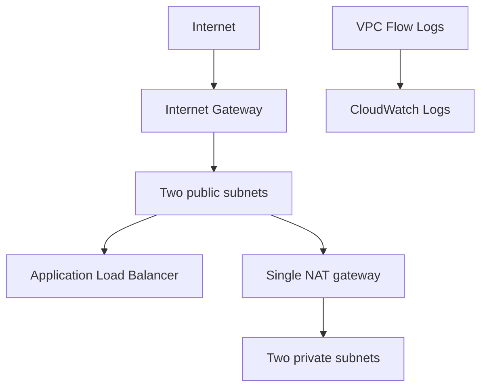

# terraform-aws-secure-vpc


> Terraform module for a two-AZ AWS VPC with public/private subnet tiers, a cost-conscious single NAT gateway, an ALB security group, optional WAF association, and CloudWatch VPC Flow Logs.

For the hiring-focused project narrative, see [docs/CASE_STUDY.md](docs/CASE_STUDY.md).

This repository demonstrates a reviewable VPC baseline, not a complete landing zone. It is intentionally explicit about what is implemented today and what should be added for higher-availability or stricter production environments.

---

## Reviewer Quick Start

For a fast technical review:

1. Inspect `main.tf` for the subnet, route table, NAT, ALB, and flow-log resources.
2. Inspect `variables.tf` for the fixed two-AZ input contract and default ALB ingress.
3. Run `terraform fmt -check`, `terraform validate`, `tflint`, and `tfsec` through the existing CI workflow.
4. Read [SECURITY.md](SECURITY.md) for assumptions and known limitations.

---

## Architecture


```mermaid
flowchart TD
    Internet[Internet] --> IGW[Internet Gateway]
    IGW --> Public[Two public subnets]
    Public --> ALB[Application Load Balancer]
    Public --> NAT[Single NAT gateway]
    NAT --> Private[Two private subnets]
    VPC[VPC Flow Logs] --> CW[CloudWatch Logs]
```

---

## What It Creates

| Area | Implementation |
|---|---|
| Network base | One VPC with DNS support and hostnames enabled |
| Public tier | Two public subnets associated with a public route table and internet gateway |
| Private tier | Two private subnets associated with one private route table |
| Egress | One NAT gateway in the first public subnet for private-subnet outbound internet |
| Edge security | ALB security group allowing 80/443 from `alb_ingress_cidrs` |
| Load balancer | Public Application Load Balancer with optional WAFv2 Web ACL association |
| Visibility | VPC Flow Logs for all traffic to a CloudWatch Logs group |
| Validation | Terraform fmt/validate, TFLint, and tfsec in CI |

---

## What It Does Not Create

This module does not currently include:

- isolated database subnets
- NAT gateway per AZ
- VPC endpoints for S3, DynamoDB, ECR, SSM, KMS, or CloudWatch Logs
- S3 destination for flow logs
- ALB access logs
- workload security groups beyond the ALB security group
- VPN, Transit Gateway, or VPC peering
- AWS Config rules or GuardDuty

For production environments with strict availability requirements, add NAT per AZ or use private service endpoints to reduce NAT dependency.

---

## Usage

```hcl
module "secure_vpc" {
  source = "./"

  name_prefix        = "demo"
  vpc_cidr           = "10.20.0.0/16"
  availability_zones = ["eu-west-1a", "eu-west-1b"]

  public_subnet_cidrs  = ["10.20.1.0/24", "10.20.2.0/24"]
  private_subnet_cidrs = ["10.20.11.0/24", "10.20.12.0/24"]

  alb_ingress_cidrs        = ["203.0.113.0/24"]
  flow_logs_retention_days = 90

  tags = {
    Environment = "dev"
    Owner       = "platform"
  }
}
```

---

## Subnet Tiers

| Tier | Internet Access | Use Case |
|---|---|---|
| Public | Inbound via IGW for ALB/NAT resources | ALB and NAT gateway |
| Private | Outbound through NAT gateway | Application workloads that should not have public IPs |

---

## Security Notes

- The ALB ingress CIDR defaults to `0.0.0.0/0` for internet-facing demos; restrict it for internal or client-specific deployments.
- The ALB security group has outbound `0.0.0.0/0`; workload security groups should be created separately with tighter egress.
- A single NAT gateway is simpler and cheaper, but it is not highly available across AZ failure.
- Flow logs are sent to CloudWatch Logs only in the current implementation.

---

## Requirements

- Terraform >= 1.5
- AWS provider >= 5.0
- IAM permissions for VPC, EC2 networking, Elastic Load Balancing, CloudWatch Logs, IAM role/policy creation for flow logs, and optional WAF association

---

## Related

- [terraform-aws-iam-baseline](https://github.com/giselleevita/terraform-aws-iam-baseline) - focused IAM S3 read role module
- [secure-docs-aws](https://github.com/giselleevita/secure-docs-aws) - encrypted document storage pattern with Cognito, Lambda, S3, KMS, and audit logging

---

## Next Improvements

- Add optional isolated subnets.
- Add NAT-per-AZ mode.
- Add VPC endpoints for S3, DynamoDB, ECR, SSM, KMS, and CloudWatch Logs.
- Add ALB access logging.
- Add Terraform tests for route table, subnet, and security group expectations.

---

## License

MIT
